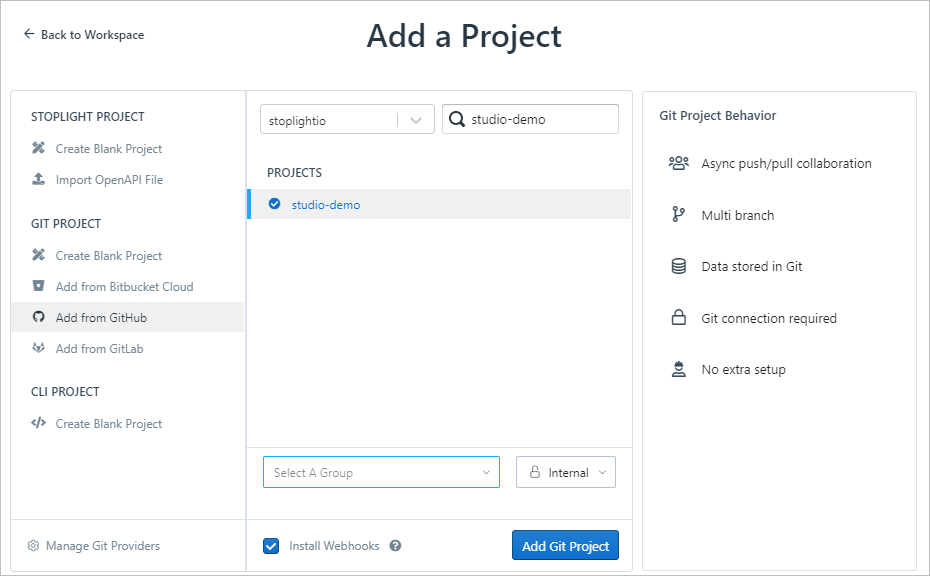
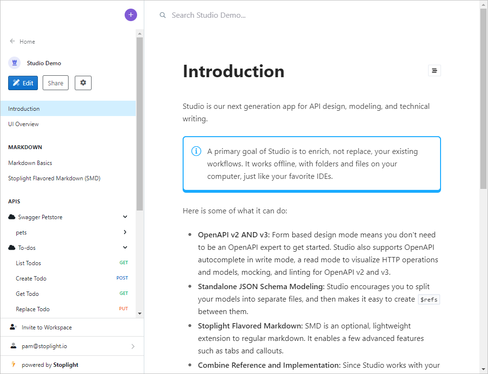

# Getting Started

## Creating Your First Project

The quickest way to get up and running with Studio is to clone an existing Git repository. If you're running Studio Desktop, you can choose a location on your computer where a repository already exists. In Studio Web or Desktop, you can copy the URL to any GitHub, Bitbucket, GitLab, Gitea, or other Git repository. 

Give it a shot with our sample project:

1. In Studio Web, select the **Add Project** icon at the top of the left navigation pane. 
   
2. Select **Add from GitHub**, add the studio-demo URL, and then select **Add Git Project**.
   ```
   https://github.com/stoplightio/studio-demo

   ```
   

   In Studio Desktop, paste the URL into the Open Git Project page, and then select **Clone**.
   

3. Explore the demo documentation, APIs, and schemas. 

   

> Note that the screenshot above is of Studio Web. There are slight differences in Studio Desktop.

4. Select **Edit** to begin working with API designs, documentation, models, and more.


## Creating an API

To create a new API:

1. Select the **Add** icon, and then select **API**.

<!-- 
focus: false
 -->


2. From the New OpenAPI pages, name your API, and then select the OpenAPI version and storage format (YAML or JSON). You can also choose to import an existing YAML or JSON file.

<!-- 
focus: false
 -->


3. Click **Create**. A new API description document is added to your project. 

4. Add global information about the API (summary, description, servers, and more). 

5. Continue on to the [API Design Guide](./Design-and-Modeling/01-getting-started.md) to get started designing APIs.
