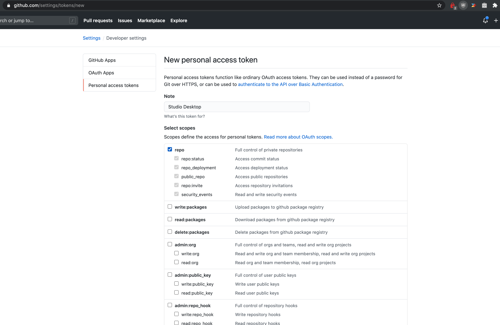

# Git Credentials 

<!-- Move this topic to platform -->

Studio Web uses the Git Credentials associated with your Stoplight account, depending on the Git provider being used. That means if you connect a GitHub and a BitBucket account, and work on a Git Project which is hosted on BitBucket, it's going to know to use the BitBucket credentials. You don't need to think about it at all.

## Adding Github Credentials in Studio Desktop

<!-- markdown-link-check-disable -->
1. Create a [new personal access token](https://github.com/settings/tokens/new) (more information in the [creating personal access tokens guide on Github](https://docs.github.com/en/github/authenticating-to-github/creating-a-personal-access-token).
<!-- markdown-link-check-enable -->
2. Choose "repo" permissions to allow enable read/writing files in your Git repository then generate the token.

3. In Studio Desktop, open a Git project.

4. From the hamburger menu, select **Git > Manage Credentials**, and then add:

- **Host URL:** `https://github.com/`
- **Username:** Your GitHub username, e.g.: `janesmith123`
- **Password:** The Personal Access Token you just created
- **Author Name:** A display name, usually a full name, e.g.: `Jane Smith`
- **Author Email:** Your GitHub email address

> Keep in mind that these credentials are stored on your local computer as a security measure, so if you switch computers you'll need to repeat this step.

## Other Git Providers

The instructions are pretty similar for all the other Git providers we support: GitLab, BitBucket Cloud, BitBucket Server, Azure, etc. Generally you want to point your Host URL to the main host of the server, so for GitLab that'll be `https://gitlab.com/` 

If they support personal access tokens you can use that instead of entering your actual password, but not every provider supports this.

## Working with Git

Once this is done, check out our guide on [Common Git Tasks](Basics/04-common-git-tasks.md) to get pushing, pulling, switching branches and all sorts of other Git magic.
