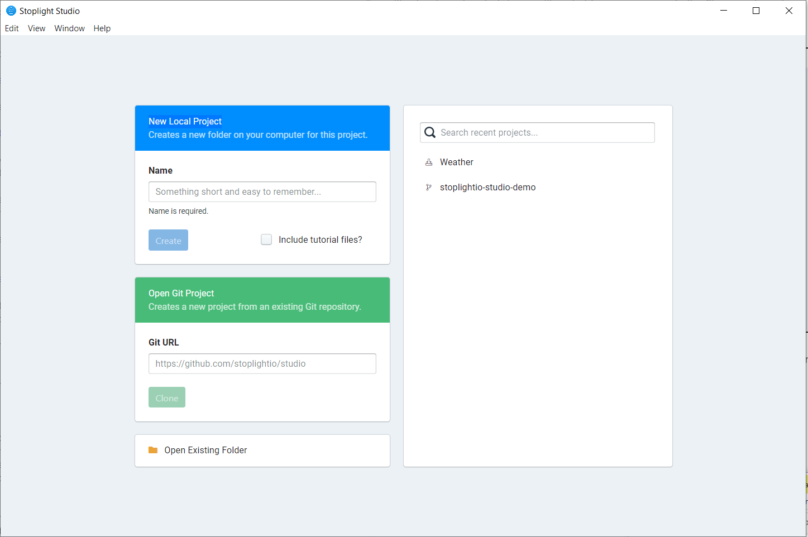
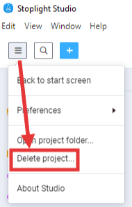

# Work with Projects in Studio Desktop

Projects in Studio provide a place for you to manage collections of APIs, articles, and any other files that you want to store together. You can have as many projects as you like, but keep in mind that you'll probably want to store similar files together when possible.

A project can be a Git repository, or if you're using Studio Desktop it could just be any local folder on your computer.

## Ways to Create a Project

There are three ways to create a project in Studio Desktop.

### From Scratch

The quickest way to get started with Studio is to create a local project scratch. Use the **Create New Project ** area of the Studio landing page:

Optionally, select **Include tutorial files** to add a few sample files to your new project.

#### Where are "From Scratch" projects stored?

Projects created from Studio Desktop's **New Local Project** are created under your default documents folder:

- On macOS, the default folder is `$HOME/Documents/Stoplight Studio`
- On Windows, the default folder is `%HOMEDRIVE%%HOMEPATH%/Documents/Stoplight Studio`
- On Linux, the default folder is `$HOME/Documents/Stoplight Studio`

### From Git

Projects typically map directly to a **Git repository**. Git allows you to easily version files, track changes, and collaborate with others in a distributed manner. Studio offers native Git integration, allowing you to create projects directly from your existing repositories in Github, Bitbucket, GitLab, and any other source control provider that uses the Git protocol.

To create a project from an existing Git repository, enter the repository URL in the **Open Git Project** area of the Studio startup screen, and then select **Clone**.

Once the project is retrieved from the provider, you can make changes, create new branches, and push updates.

### From an Existing Folder

You can also create projects from an existing directory/folder on your computer. No Git or source control is required. To do this, select **Open Existing Folder** from the Studio startup screen.

You can then select the folder you would like to use as a project.

## Delete Projects

To delete a project in Studio Desktop:

1. Open the project.
2. From the hamburger menu, select **Delete project**.
3. Choose one of these options:
   * **Confirm**: Deletes the project in Studio Desktop, but leaves the files intact.
   * **Confirm and remove files**: Deletes the project in Studio Desktop and the files on your local system.

