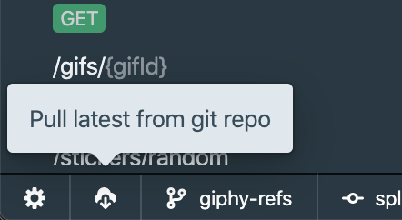

# Commit & Push Changes

Projects using Git as the source of truth have a bunch of extra functionality enabled, as Stoplight Studio has first-class support for common Git tasks like pushing, pulling, creating/switching branches, comparing differences, etc.

If you are new to Git, it's a version control system which can help a bunch of developers collaborate on a bunch of different things without clobbering each others work, or it can help just one developer keep track of various in-progress changes. GitHub is one popular Git repository hosting provider of many. They have written a nice [introduction to Git](https://guides.github.com/introduction/git-handbook/) which you might want to check out if you're new to Git entirely.

You don't need to know too much about the complexities of Git in order to get things done in Studio, but the following actions are worth knowing about.

## Committing Changes

When working on files you want to save them to persist the changes to your computer (or "local storage" in the browser if you're using Studio Web). This will not update those changes in the Git repository, because that would cause anarchy and lost work every time somebody hit save.

Git has two concepts known as "Commit" and "Push". Commit is the act of staging a bunch of changes into one grouping of changes along with a commit message. Commits can then be pushed to the repository, and so long as there are no conflicts the commit will be pushed successfully.

Careful not to click that red button. I know it's tempting, but discarding all your changes will reset files back to how they were in the last commit, meaning even saved changes will be gone.

When a commit has been pushed, people using the same branch can then pull your changes down.

## Pulling Changes

If somebody else has pushed and you'd like to get their changes, click the pull button.

This will update your local files, so you can continue working from where they left off.

## Switching Branches

Git is a very open-ended technology which can be used in a lot of different ways. Everyone can commit to the same branch (usually called `master`), or people can work in different branches to be merged later. To switch branches, look for the Git icon next to the branch name.

A drawer will appear in the middle of the screen, allowing you to search through existing branches. To make a new one, type in a name for a branch which does not exist. If you are adding a new endpoint, the branch could be `new-companies-endpoint`. 

Hit enter or click the "(+)" icon and you've switched (a.k.a "checked out") the new branch.

## Using Other Clients

If you already have a favorite Git client like [git cli](https://git-scm.com/docs/gitcli), [Github Desktop](https://desktop.github.com/), [Sourcetree](https://www.sourcetreeapp.com), or similar, then you're very welcome to continue using them. You'll need to give Stoplight a reload (CMD + R / Ctrl + R) for now, then Studio will notice the changes and you're all set. 
