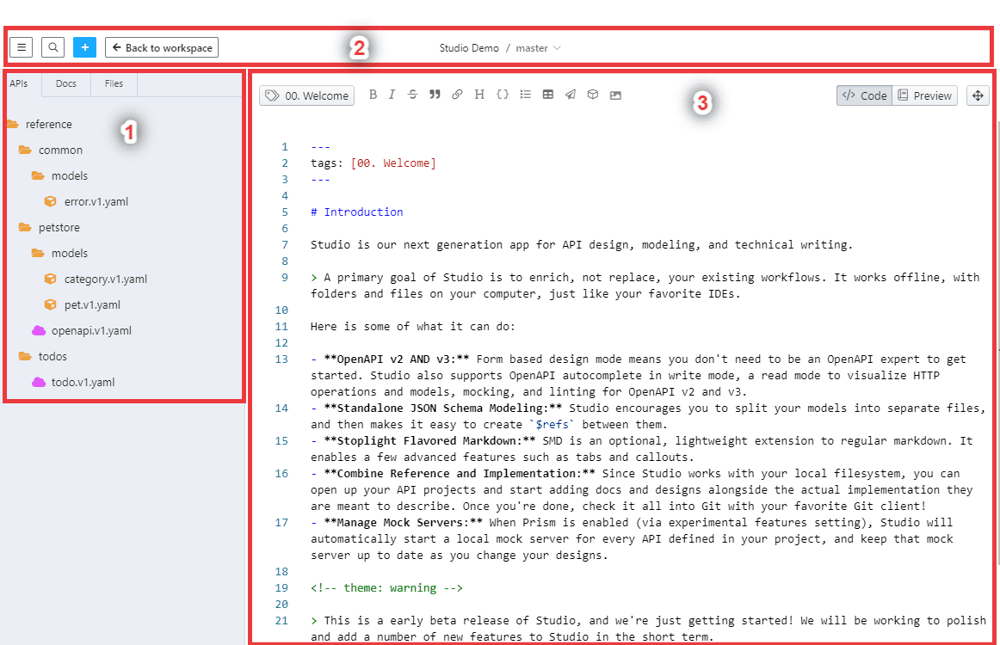
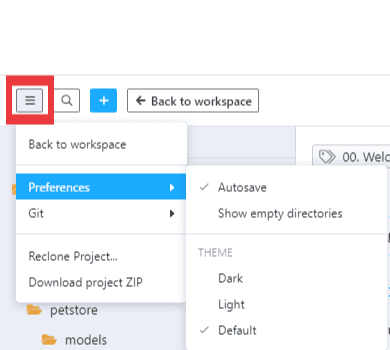

# Project UI Overview

Use projects to manage APIs, documentation, and related files. Projects work and look the same in Studio Web and Studio Desktop, with a few differences. This topic describes projects in Studio Web. 

To open a project:

1. From the **Home** page:
   - Select the project from the project sidebar (left pane), or 
   - Select **Projects** from the tab the top of the page, and then click the name link for a project. 

2. Project owners, admins, and editors can select **Edit** to manage the project. Viewers can navigate and read project content. 

Once you are editing a project, there are three key areas of the interface:

1. Project sidebar
2. Project toolbar
3. Editor panel

## Project Sidebar

Switch between three tabs to work with project content:

- **APIs** lists APIs, endpoints, and models.
- **Docs** lists Markdown and image files.
- **Files** lists all project files.

Select an item on any tab to open it in the Editor panel. 

## Project Toolbar

**Project Options**: Select the hamburger menu to work with these options:

* **Back to Workspace**: Leaves edit mode and returns you to the workspace home.
* **Preferences**: 
  - Autosave
  - Show empty directories
  - Theme (dark, light, or the default set in Workspace settings)
* **Git**:
  - Auto-pull 
  - Auto-translate SSH URLs)
  <!-- https://github.com/stoplightio/platform-docs/issues/159 created to better document Git settings at a later time -->
* **Reclone Project**
* [**Download Project ZIP**](download-project.md)

<!-- focus: center -->

**Search**: Find anything in your project files. 

**Add to Project**: Use to add new assets to your project. This includes APIs, endpoints, models, articles, style guides, images, table of contents, files and directories. You can also import files and import directories and add a [Stoplight Config file](03-stoplight-config.md) to your project. 

**Project Actions** (Changes depending on your state):
  - **Back to workspace**: Shows when no changes have been made to the project.
  - **Publish**: When the project is not connected to a repository, shows when at least one change has been made in the project. Select the down arrow to discard changes. 
  - **Commit and Publish**: When the project is connection to a repository, shows when at least one change has been made in the project. Select the down arrow to discard changes. 

**Project Name**: Shows the name of the current project. If the project is connected to a repository, the name of the burrent branch is also shown. Select the down arrow to pull changes into your project or to switch branches. 

## Editor Panel

Use the main editor panel to design APIs and write documentation. Choose different views:
 - **Form**: Offers an intiutive editor for APIs, endpoints, and models. 
 - **Code**: Enables the code view for applicable files. 
 - **Preview**: Provides a preview of what the selected file will look like when it is published. For API operations, the [Try It](../Design-and-Modeling/03-http-endpoints.md) feature is available in Preview mode. 

 **Validation and Linting** displays issues related to your API Specification (powered by Spectral). Select to expand window and view error and warning details and locations.

A **Secondary Panel** is available on larger screens (width > 1400px). Switch between view types via the view toggle in the top right of the panel.

