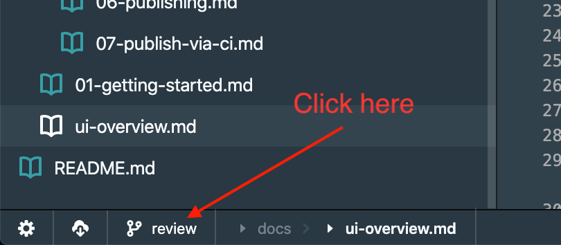
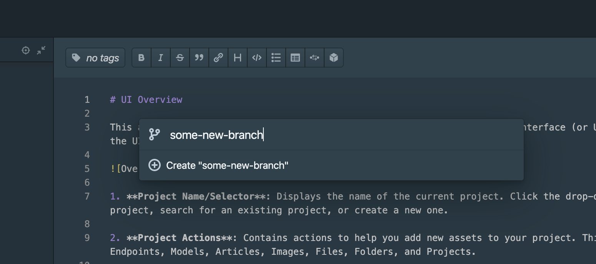

# Design Review Process

When you're a solo developer working on an API design, the process is pretty simple:

1. Make some changes
2. They're great
3. Ship it

When multiple developers are working on the API, and when multipe teams are all making multiple APIs, quality control can suddenly feel a bit more important. 

Most developers are used to changing to source code in version control systems via "pull requests", at which point various teammates or other folks will review the code. Seeing as Stoplight lets you continue to use your git repo as a source of truth for your API descriptions, this same process can be used for OpenAPI and JSON Schema reviews too!

## 1. Open a Project in Studio

[Create or open a Project](../Basics/01-working-with-projects.md) in Studio Web or Desktop.

## 2. Create a new Branch

A lot of Git repositories (especially those on GitHub) are configured to use [protected branches](https://help.github.com/en/github/administering-a-repository/about-protected-branches), which means pushing to master is not possible. Maybe you can push to master, maybe not, but if you'd like other people to review your work, it is best to create a branch to keep the changes out of master until they've been reviewed.

A drawer will appear in the middle of the screen, allowing you to search through existing branches. To make a new one, type in a name for a branch which does not exist. If you are adding a new endpoint, the branch could be `new-companies-endpoint`. 

Hit enter or click the "(+)" icon and you've switched (a.k.a "checked out") the new branch.

## 3. Make Changes, Commit, & Push

We Dont have ANY DOCS for comitting and pushing!? 

## 4. Publish the branch 

manually in Studio, automatically via continuous integration, and soon via a Git webhook 🙌)

## 5. Open a Pull Request

in GitHub, Gitea, BitBucket, etc.

## 6. Link to Branch Documentation in Pull Request
   
There are plans to refine this process, to make you not need to jump over to the version control system interface. For example, soon you will be able to create pull requests right from the Studio interface. Another improvement: pull requests will automatically show a link to the branches documentation, making the review part very simple. 

Design Reviews will become more accessible for non-technical people, but for now your technical writers and review people can use the standard pull-request flow for your VCS of choice.
