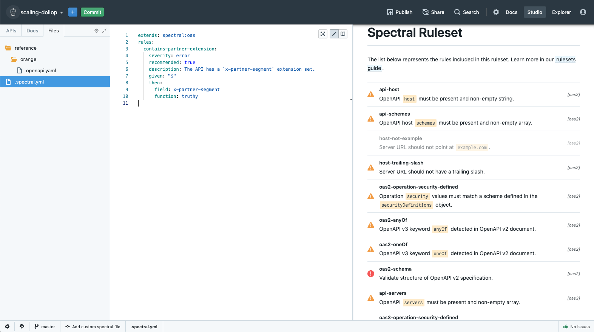

# Using Custom Lint Rules

Embedded inside of Studio is [Spectral](https://stoplight.io/p/docs/gh/stoplightio/spectral),
Stoplight’s custom lint and validation engine.
Leveraging Spectral, you can create custom rulesets that automatically enforce your organization's API style guides
and surface errors at design time directly in the editor.
Customizing the lint rules allow you to enable/disable built-in rules,
add your own rules, and even change rule severities.



To configure custom lint and validation rules for a project:

1. If you haven't already done so, navigate to the project you want to customize the rules for
2. Once in the project, select the **+** button at the top left of the screen and select **File** from the dropdown to create a new file
3. Enter the file name `.spectral.json` (or `.spectral.yml` if you prefer YAML formatting)
4. Once created, select the new file from the "Files" sidebar menu
5. Customize file with your own Spectral ruleset settings, for example (if using JSON):

   ```json
   {
      "extends": "spectral:oas",
      "rules": {
         "my-rule-name": {
            "description": "Tags should have a description.",
            "given": "$.tags[*]",
            "recommended": true,
            "then": {
               "field": "description",
               "function": "truthy"
            }
         }
      }
   }
   ```

For more information on how to customize Spectral rulesets, head over to the [Spectral documentation](https://stoplight.io/p/docs/gh/stoplightio/spectral/docs/getting-started/rulesets.md).

> This functionality was added with v1.1.0 of Stoplight Studio.
